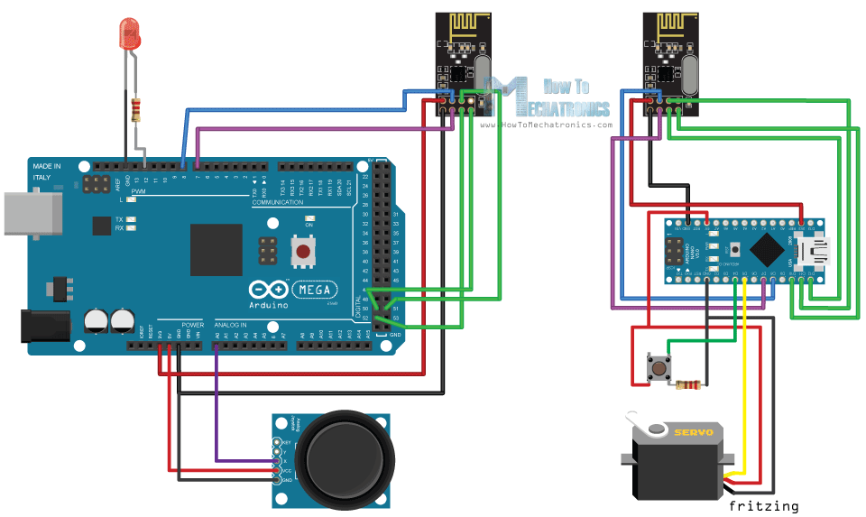
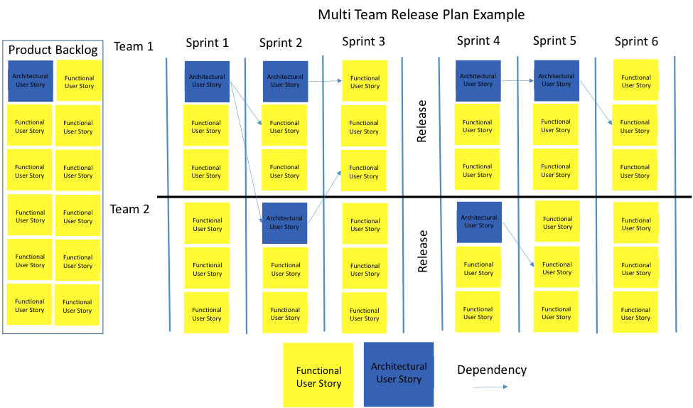

# Analyse

Voor dat jullie kunnen starten aan een project moet je hiervoor een analyse
indienen. Deze verdedigen jullie met een presentatie tijdens het voorgestelde
contact moment. Voor dat je aan het project mag beginnen, moet de analyse
worden goedgekeurd door de docenten.  

De analyse moet grondig worden uitgewerkt. De analyse is een leidraad doorheen
het project die ervoor zorgt dat er op een efficiënte manier functionaliteit
wordt gecreëerd.

Je voegt de analyse toe in jullie studentrepo op de volgende locatie:
`doc/analyse.md` en schrijft deze in Markdown formaat.

## Functionale analyse project 

### Beschrijving
Hieronder beschrijven jullie het project dan jullie gaan uitvoeren doorheen het
semester. Het doel van een Internet of Things is slim maken van domme objecten.
Hiervoor moeten we een dom object transformeren in een Smart Object. We kunnen
een Smart Object definiëren aan de 4 volgende criteria. 

1. Monitoring
2. Controle
3. Optimalisatie
4. Autonomie

Probeer jullie Smart Object in jullie project aan deze objecten te staven.
Doe dit voor elk smart object in jullie project. In de vaknaam komt ook
internet in voor. Voorzie ook een manier hoe dat jullie connectie gaan opbouwen
tussen de verschillende Smart Objects en eventueel achterliggende services
zoals, servers, databases, dashboards, etc...

Het minimum aantal tekens voor deze tekst is 3000.

### Marktonderzoek 

Tijdens Internet of Things gaan we geen nieuwe zaken ontwikkelen maar is het de
bedoeling om een elektronica project succesvol af te werken en nieuwe skills te
leren. 

In deze sectie gaan jullie opzoek naar gelijkaardige producten. Je zoekt er
minimaal 5. Dit mogen ook producten zijn waarvan hun functionaliteit wilt
toepassen in jullie product. 

Je geeft deze informatie weer in een tabel. 

### Diagrammen
Tekst in niet zo overzichtelijk als een diagram. Voorzie de nodige documentatie
in de vorm van diagram of afbeelding. 

**Verzorg deze afbeelding! Denk aan layout, kwaliteit van de afbeeld, crop de
afbeelding wanneer nodig, etc...**

#### Algemene architectuur
Geef een algemeen overzicht hoe dat de verschillende componenten met elkaar
spreken. Toon aan op welke draadloze technieken er gebruikt worden. Als
voorbeeld de algemene architectuur van LoRaWAN.

#### Gedetailleerde diagrammen
Hieronder vallen de volgende zaken:
- Flow charts
- Relationele database schema
- Blokdiagrama van individuele elementen in de architectuur.
- ...

#### Schema's van het product
Het is zeker al aan te raden dat er een schema is van het Smart Object. Dit is
een schema die de aansluitingen van het Smart Object toont.

Dit kan zo simpel zijn als het volgende:

**Dit mag al een volledig schema zijn in multisim of ander EDA programma.**

#### Fysiek design (Optioneel)
Er zijn 2 3D printers ter beschikking. Je mag deze alleen gebruiken als je
enige ervaring hebt met CAD software. Je mag deze gebruiken om een volledige
fysiek design van je Smart Object te maken.

#### Niet functionele analyse 

Maak ook een analyse voor niet functionele vereisten voor het project. Voor
mogelijke niet functionele requirements verwijs ik jullie door naar wikipedia:
[Non-functional
requirement](https://en.wikipedia.org/wiki/Non-functional_requirement). Kies er
4 uit de mogelijke examples gegeven op de wikipedia pagina en bespreek deze. 

De niet functionele vereisten van het project zijn niet nodig voor een geslaagd
project. Ze zijn een leuke extra. Jullie kunnen ze bv uitvoeren wannneer je
geblokkeerd bent door een medestudent.

**Je mag deze alleen gebruiken als een teamlid tijdens de verdediging,
competentie aantoont in geschikte CAD software om een 3D print te maken.**

## Functionaliteit

We maken gebruik van een Agile methode, hierdoor beschrijven we onze
functionaliteit die we willen toevoegen aan ons project met Epics en User
Stories. Beide zaken gaan we managen in Jira. Je voorziet minimaal 6 epics met
elks 8 user stories. 

| Epic          | Epic #1 | Epic #2 | Epic #3 | ... | Epic #N            |
| ---           | ---     | ---     | ---     | --- | ---                |
| User Story #1 |         |         |         |     |                    |
| User Story #2 |         |         |         |     |                    |
| User Story #3 |         |         |         |     |                    |
| User Story #4 |         |         |         |     |                    |
| User Story #5 |         |         |         |     | <html>&nbsp</html> |

Wijs ook een verantwoordelijke toe voor elke epic. Deze epic hoort bij een
verschillende rol opgenomen door één student. Onder elke epic staat ook een
user story. Elke user story krijgt story points. Je mag op eigen
verantwoordelijk ook tasks aanmaken in Jira.

**Deze story points moeten zeker worden toegevoed. Jullie projectperformantie
word gemeten aan de hand van burndown charts.**

## Release Plan 
We gaan ons eigen beschermen door voor ons zelf deadlines op te stellen. We
gaan onze user stories inplannen om het team verantwoordelijk te houden. Er
zijn 4 releases voorzien doorheen het semester. Zie hiervoor de planning.

## Inventarisatie Hardware
Sommeer hier de gebruikte hardware die je wilt gebruiken voor jullie project.
Ligt ook toe waarom elk item geschikt is voor dit project. Vergelijk hiervoor
ook de mogelijke kandidaten dat dit item kunnen vervangen. 

Lijst hier ook de schemas op de je als inspiratie bron gebruikte voor jullie
eigen project.

## Inventarisatie Software 
Sommeer hier de gebruikte software die je wilt gebruiken voor jullie project.
Ligt ook toe waarom elk item geschikt is voor dit project. Vergelijk hiervoor
ook de mogelijke kandidaten dat dit item kunnen vervangen. 

## Test document
Maak een lijst van de nodige test die je kan uitvoeren voor het valideren van
je product. Dit gaat verder dan het schrijven van enkele unit test. Met deze
testen moet je ook je hardware kunnen valideren. Dit document is een *"Work in
Progress"*. Hoe verder dat jullie project loopt hoe meer features dat je hebt
toegevoegd aan je product. Met dit document kan de docent de werking van je
product valideren.

**Kijk zeker de nodige leerdoelen na**

## Verdediging

Deze analyse wordt verdedigt met een presentatie. De duur en tijdstip van deze
presentatie word nog meegedeeld.

Je voegt de presentatie toe in jullie studentrepo als Powerpoint en PDF. Je
bewaard de bestanden op de volgende locatie:i `doc/analyse.pptx` en
`doc/analyse.pdf`

