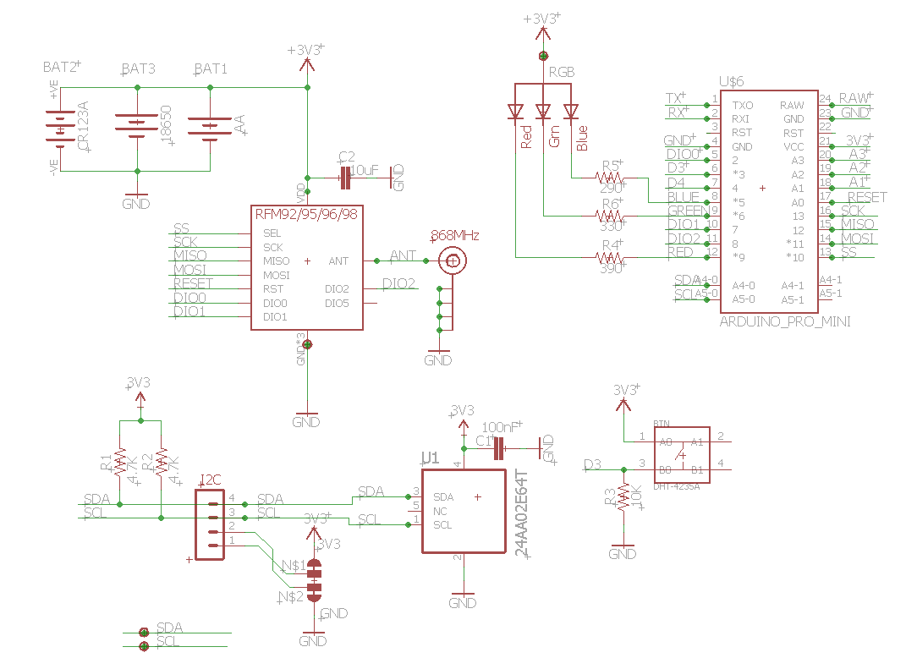
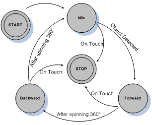
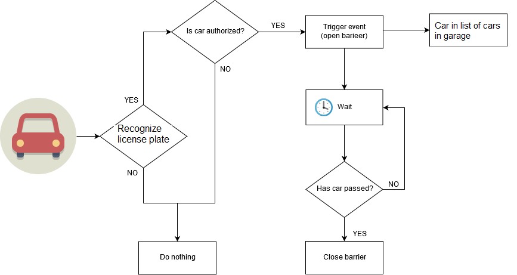
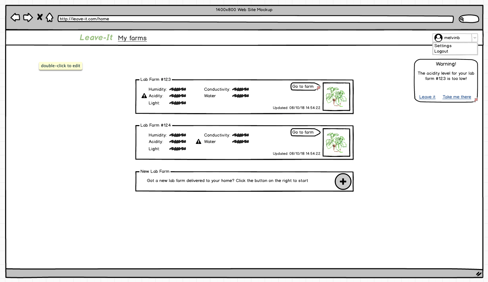
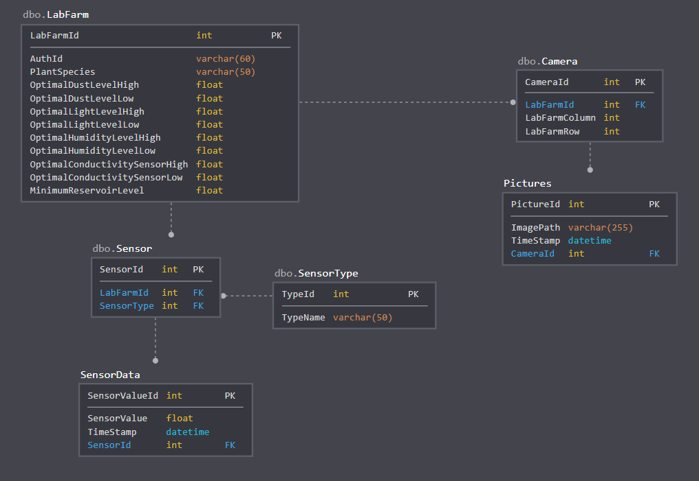

# Project Analyse 

Net zoals bij Smart Systems werken we met een probleemstelling. Voor Internet
of Things is deze breder gedefinieerd. Voor een geslaagd project moet je de
scope van de probleemstelling gaan verkleinen naar een haalbaar project. Dit
gebeurt in het volgend stuk. Dit proces is essentieel voor een geslaagd project
en hierdoor is de analyse kritieker dan bij Smart Systems. Ga hier niet te licht
over!  

Hieronder beschrijven jullie de probleemstelling dat tijdens IoT  word
behandelt. Eerst moeten jullie context geven over de specifieke
probleemstelling van het project. Dit uit zich in een onderzoeksvraag voor het
project. Daarna licht je de onderzoeksvraag verder door in het voorstel tot oplossing. 

De problemen die opgelost worden tijdens het vak Internet of Things hebben
meestal als oplossing een Smart Objects gecombineerd met ondersteunende back
-en frontend. Deze componenten worden in de project analyse gedefinieerd. 

## Onderzoeksvraag 

Beschrijf het probleem dat opgelost wordt tijdens dit project in vraag vorm.

## Voorstel tot oplossing

### Overzicht oplossing

In het overzicht wordt het voorstel tot oplossing beknopt beschreven. Voor dit
te doen schrijf je een korte tekst van min 250 woorden en max 500 woorden. Dit
komt neer op halve tot een volle bladzijde. Je ondersteund dit met een diagram
van de algemene architectuur.

 Voorbeeld: het diagram van de algemene architectuur van LoRaWAN. 

### Detail analyse

In de detail analyse gaan we elke component van het algemene diagram verder
analyseren. Uit voorafgaande projecten kan er afgeleid worden dat de
onderstaande zaken vaak voorkomend zijn. Vul indien nodig aan naar de noden van
het project.  

#### Smart Object

IoT is een hardware project. De focus ligt op het ontwikkelen van een fysiek
object. Dit object krijgt prioriteit tijdens dit vak, niet de front end of back
end die nodig is voor een volwaardige oplossing. De tijd is beperkt dus word er
een focus gelegd. Dit object uit zich in een Smart Object. Een Smart Object kan
beschreven worden aan de hand van de 4 volgende criteria. 

1. Monitoring
2. Controle
3. Optimalisatie
4. Autonomie

De criteria zijn geordend volgens stijgende complexiteit. Monitoring is
eenvoudiger dan een object volledig autonoom te maken. Hierdoor kan je de
criteria ook gebruiken als leidraad doorheen het iteratief proces dat we
gebruiken in IoT. Als je prototype ontwikkelt zorg er eerst voor dat het al
data kan verzamelen vooraleer dat het volledig autonoom is.

Aan de hand van bovenstaand criteria wordt er een of meerdere Smart Objects
gedefinieerd die een oplossing bied voor de probleemstelling in het project. Om
een geslaagd project moet er meerdere werkende Smart Objects zijn. Dit mogen
meerdere van hetzelfde type zijn of verschillende soorten objecten. Zo
vervolledigen jullie het Things gedeelte van IoT. Je moet nog al het
achterliggende voorzien om deze met Smart Objects met elkaar te laten spreken.

Een Smart Object is niet van nature uit een extensie van een bestaand product.
Het is ook een object dat toegevoegd kan worden aan een bestaand proces.  Jaar
op jaar worden op de akker groenten geteeld. Hoe kunnen we deze akker slim
maken? Het is geen fysiek stuk hardware waar we iets aan kunnen toevoegen. Er
kan wel een Smart Object gebouwd worden dat het landbouw proces optimaliseert. 

Beschrijf in dit deel de nodige Smart Objects voor jullie project. Naast de
beschrijving voorzie ook het volgende: 

* Blokdiagram 
* Specificaties
* Argumentatie
* Elektrisch schema
* State diagram
* Flowchart

Hieronder kan je een voorbeeld vinden van elk diagram.

 Voorbeeld: Blok diagram 

Voor elke blok in het blok diagram van een Smart Object stel je de
specificaties en/of elektrische karakteristieken op. Deze worden in het
volgende formaat meegeven in de analyse.

| Blok           | Specificatie    | Min  | Nominaal | Max    |
| --             | --              | --   | --       | --     |
| Motor Power    | Werkspanning    | 7V   | 7.2V     | 7.V    |
| (Loodbatterij) | Stroom          |      | 500mA    | 2A     |
|                | Capaciteit      |      | 2700mAh  | &nbsp; |
| ATmega328p     | Fcpu |      | 16 MHz   |        |
|                | Werkspanning    | 4.8V | 5V       | 5.2V   |
 

Voor elk blok moet je ook een argumentatie geven waarom deze gebruikt wordt in
de voorgestelde oplossing in de analyse. Geef ook mogelijke alternatieven. Geef
deze informatie in het volgend formaat: 

| Blok            | Argumentatie                                                                                                                                                                                                                                   | Alternatieven           |
| --              | --                                                                                                                                                                                                                                             | --                      |
| Motor Power     | De loodbatterij is oplaadbaar en levert de correcte spanning voor de motorsturing. De LiPo batterij is een betere oplossing vooral door gewicht en beter behoud van capaciteit. De loodbatterij was beschikbaar en moest niet aangkocht worden | LiPo, Powerbank         |
| Wireless Driver | We maken gebruik van een nRF24L01 omdat de simpelste manier van communicatie is, geen protocol en een simpele communicatie voorziet.                                                                                                           | Bluetooth, ZigBee, WiFi |

 Voorbeeld: Elektrisch schema 

 Voorbeeld: State diagram 

 Voorbeeld: Flowchart 

#### Front End
Je Smart Object gaat data generen en eventueel actuatoren aansturen. Hiervoor
is een interface nodig, een bepaalde front end. Je licht toe welke technologie
je hier gaat gebruiken en onderbouwt je keuze. We oordelen op dit stuk niet op
de technische complexiteit alleen op de toegevoegde waarde aan het project. Hou
het simpel en overzichtelijk (Geen simpele html en css maar ook geen full blown
Progressive Web App). 

Je beschrijft de functionaliteit van de front end d.m.v. mock up.

 Voorbeeld: Mockup 

#### Back End

Geef aan wat voor server technologie er gebruikt word tijdens het project. Dit
kan van self hosted, VPS, met of zonder container technologie. Geef dit
allemaal weer in een diagram. Staaf ook de gebruikte keuzes. Gebruik je een
relationele database voorzie dan ook DB model.

 Voorbeeld: Databse model 

