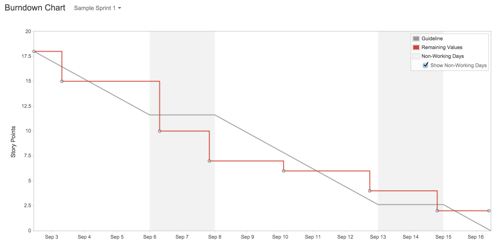

# Burndown Charts

De burndown charts in Jira worden gebruikt als performantiemeter in jullie
project. Zorg ervoor dat deze inorde zijn door correct gebruik te maken van
Jira. 

Een sprint in IoT duurt een week. Zorg ervoor dat elk teamlid een user story
krijgt toegewezen. Als een user story is afgewerkt dan word deze ook
afgesloten.

