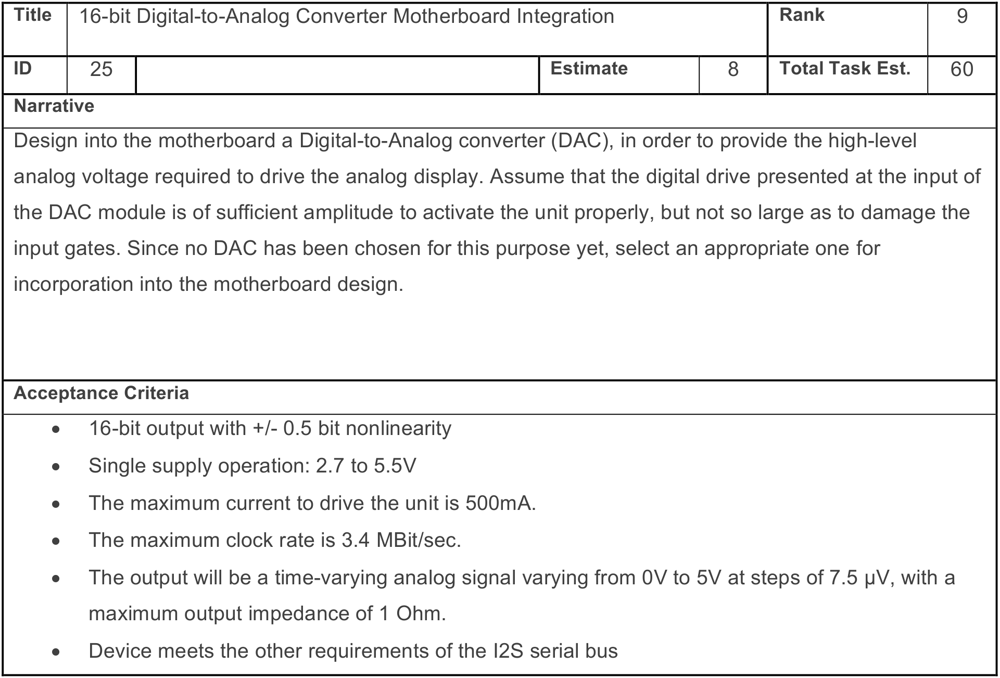
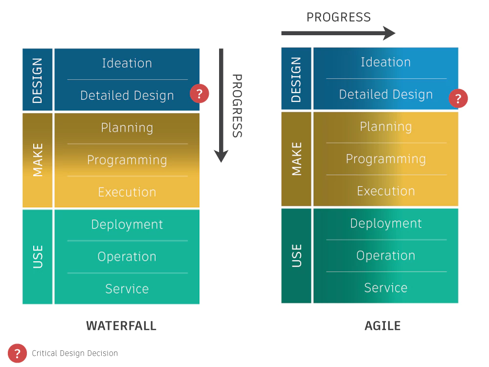

# Project Methode 

## Van analyse naar werkbeschrijving 

Tijdens het project word er Scrum toegepast om het voor een Agile werking. De
fijne details van dit framework is door dhr Peeters uitgelegd en worden hier
niet herhaald. Omdat dit een hardware project is liggen de accenten een beetje
anders. Scrum vind de oorsprong in Software projecten maar kan zeker in
Hardware worden toegepast. Het doel van deze sectie is het vertalen van de
analyse naar haalbare project scope en het definiëren van werk punten.

Het grootste verschil zijn de User Stories. De requirements van een software
project zijn afgeleid van functionele vereiste. Deze vereisten kijken uit een
standpunt van de gebruiker en zijn de te schrijven als een User Story. Dit komt
omdat de gebruiker een rol heeft in het project verhaal. 

Maar vanuit een hardware standpunt zijn de niet functionele vereiste even
belangrijk. Het is onmogelijke om een microcontroller applicatie te draaien als
microcontroller niet van stroom is voorzien. (Stroom is altijd nodig om een
applicatie te draaien. De infrastructuur die nodig is om een applicatie te
draaien hoeft niet in de scope van een software project te zitten. Voor een
software project kan men altijd gebruiken maken van IaaS of PaaS provider.)

Hiervoor gaan we gebruik maken van een Technical Story. Hier beschrijft men de
functionalteit zonder user perspectief. Een voorbeeld:

Je mag zowel de klassieke user stories gebruiken als de technical stories. Elke
story heeft wel de volgende vereisten:
- Title
- Narrative
- Acceptance Criteria 
- Story Points (Estimate)

**Hoe beginnen we dan de scope van het project te bepalen?**

We gaan er van uit dat ontleding van de scope component gebaseerd is i.p.v.
functionaliteit gebaseerd.

Dit doen we omdat de componenten (blokken) in het systeem al bepaald zijn in de
software -en hardware analyse.

Dus voor elke blok in het systeem maken we een epic aan. Als er blokken zijn
die voor hardware -en software samen neembaar zijn mag dit. Bij twijfel scheid
je ze. Voorzie voor elke epic 5 a 7 stories. Deze moeten gedetailleerd zijn. 

**Beschrijf je epics en stories op Jira**

## Van werkbeschrijving naar planning. 

Het grote probleem van Scrum voor Hardware projecten is dat het initieel geen
rekening houd met lange lead times. Dit is de tijd de start van een proces tot
het eind. Als we als voorbeeld nemen we het ontwikkelen van een printplaat, dit
heeft de volgende stappen met een geschatte tijd. 

| Stap                    | Geschatte tijd |
| --                      | --             |
| Schema                  | 5 dagen        |
| Design                  | 5 dagen        |
| Bestellen componenten   | 7 dagen        |
| Productie PCB           | 21 dagen       |
| Bestukken               | 1 dag          |
| Validatie               | 1 dag          |
| **Totaal aantal dagen** | **40 dagen**   |

De productie van een PCB duurt 40 dagen terwijl een sprint een duur heeft van 2
tot 4 weken (14 tot 28 dagen.) Dit zorgt voor problemen. Dit kan een blokkende
factor zijn voor specifieke zaken. Daarom moeten we enkele sprints op voorhand
inplannen. Zodat de prioriteiten goed gelegd worden en er geen dode momenten
zijn. Dit wil niet zeggen dat de volgende sprints in steen staan geschreven. Er
kan na elke sprint nog steeds geschoven worden, rekening houden met het grote
plaatje. De output van deze planning geeft als resultaat een release planning. 

Een voorbeeld: 

*De pijlen geven prerequsites weer*

**Voor je analyse document voeg je deze planning toe.**

**Plan je eerste sprint op Jira.**

Hou je met je planning rekening met het volgende:

T.o.v. het klassieke waterfall model gebeuren alle aspecten van het proces simultaan. Start met testen en integreren van de verschillende blokken zo snel mogelijk

#Leesvoer

Bovenstaande informatie is gedestilleerd uit:
- [Agile Processes for Hardware Development](https../..//www.cprime.com/wp-content/uploads/woocommerce_uploads/2015/10/Agile-Processes-for-Hardware-Development-cPrime.pdf)
- [Eleven Lessons Learned about Agile Hardware Development](https../..//www.cprime.com/wp-content/uploads/woocommerce_uploads/2016/05/Lessons-Learned-Agile-Hardware-cPrime.pdf)

Gelieve deze document door te nemen
