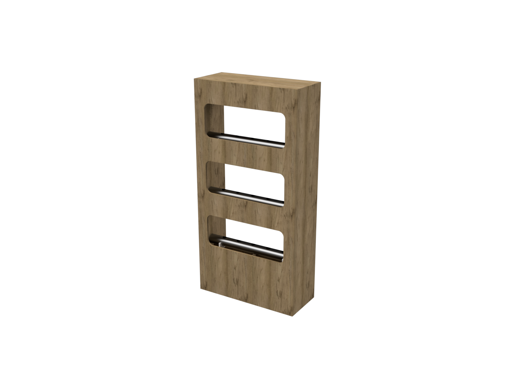

# Lab Farm 

## Korte beschrijving van het project

Afgelopen jaren zijn we al bezig met het ontwikkelen van een hydrophonics opstelling.

> Hydroponics is a type of horticulture and a subset of hydroculture, which is a method of growing plants, usually crops, without soil, by using mineral nutrient solutions in an aqueous solvent. Terrestrial plants may be grown with only their roots exposed to the nutritious liquid, or, in addition, the roots may be physically supported by an inert medium such as perlite, gravel, or other substrates. Despite inert media, roots can cause changes of the rhizosphere pH and root exudates can affect the rhizosphere biology. [Wikipedia](https://en.wikipedia.org/wiki/Hydroponics)

In de iteratie van dit jaar willen we de volgende zaken veranderen
* Opsplitsen van de huidige monolitsche printplaat naar meerdere 
    * Niet meer gebaseerd op de Raspberry Pi maar ESP
* Bouwen van XY systeem met een beweegbare camera
    * Bouwen van AI cluster computer voor beeldverwerking 
* Overschakelen naar een simplistische UI op basis van Node-RED

Al deze zaken worden uitgevoerd door meer Teams.

## Verwachte output

* Voor de volgende controllers een PCB en UI in Node RED
    * Pomp controller
    * Lighting controller
    * XY controller
    * Sensor Controller 

