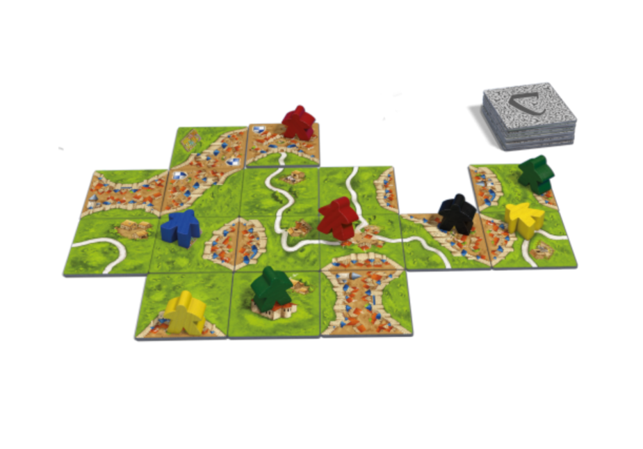
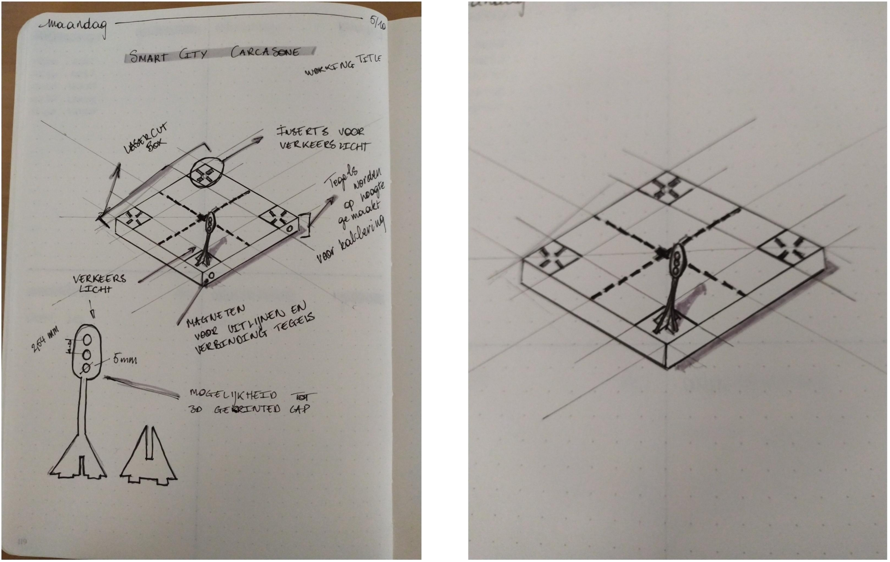

# Smart City Tiles
Voor het Smart City Tiles (SCT) halen we inspiratie uit het gezelschapsspel
Carcasonne. Gedurende dit spel leg je speltegels op tafel waarmee je een stad
opbouwt en op deze manier punten verdient. Elk rondje van dit spel is anders
omdat je met de tegels een stad kunnen opbouwen in oneindig verschillende
manieren. Het is deze flexibiliteit dat toegepast zal worden op het SCT remote
lab.

Het middeleeuws thema van dit spel is wel niet herbruikbaar. We vormen dit
om naar een futuristische omgeving waar alles op een afstand kan
aangestuurd worden. Dit kan eenvoudig gaan van een verkeerslicht tot een
zelfrijdende auto die zicht begeeft op de SCT. Door het combineren van
verschillende of het toevoegen SCT kunnen we verschillende labos voorzien
Hieronder kan je de concept sketch vinden van één mogelijke tegel

